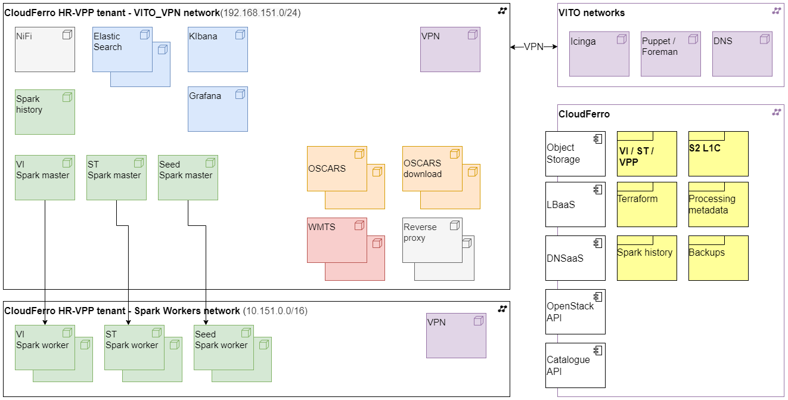

# Deployment of cloud infrastructure resources

## Overview

Cloud infrastructure resources, being Virtual machines and object storage,
* for [networking](./networking.md) (e.g. DNS, VPN, Load balancing), 
* for [storage](./storage.md) (S3 object storage) and 
* for product generation (Spark cluster, NiFi workflows)
* for product access web services (catalogue for search/download, WMS/WMTS map viewing)
* for ElasticSearch database
* for monitoring, logging and backups (Kibana, Grafana, Spark history, backups for ElasticSearch and NiFi)

are provisioned using *Terraform* and Packer.

The processing of large data volumes, for product generation, ingestion in the web catalogue and WMTS cache seeding, is done in Apach NiFi workflows that submit jobs to scalable [Spark clusters](./spark_clusters.md).

## Terraform and Packer

The required version of Terraform is mentioned in the [requirements.tf](./requirements.tf) file.
It is important that the version of Terraform is not too new, to ensure compatibility with the stored Terraform state information.
Older versions of Terraform can be downloaded [here](https://releases.hashicorp.com/terraform).

First log into OpenStack tenant, select the project and download the RC file.

In case a Puppet base image is not yet available, you first need to generate one as explained in the following paragraph.

Then, source the RC file and initialize Terraform to download all necessary Terraform providers and to fetch the Terraform state which is stored in the object storage.

~~~~
source openrc.sh
terraform init
~~~~

Specific Terraform workspaces are defined (with _prd_ in their name) for the production services and three (vi, ts, seed) production Spark clusters.

Select the production workspace and change the variables accordingly.

~~~~
terraform workspace select prd
terraform apply --var-file=vars/prd.tfvars
~~~~

Or, for the production seed cluster:

~~~~
terraform workspace select seed-prd
terraform apply --var-file=vars/seed-prd.tfvars
~~~~

## Generate Puppet base image

A base image puppet_base_image is needed to deploy the virtual machine instances. This image can be generated using Packer.

## Generate Spark worker images

Spark worker images are provisioned by Puppet, but as they are not in the VPN network a VM image is built before provisioning them. 
This is more flexible in the selection of the VM flavour (use of smaller flavours). 

To bypass the IP limitation of the VPN network, workers are deployed in a dedicated non-VPN network. To generate a new Spark worker image:

~~~~
cd packer
packer build -var 'environment=prd' -var 'purpose=vi' spark_worker_image/packer.json
~~~~

Using the variable names will point the worker to join the cluster with the spark_master name.
