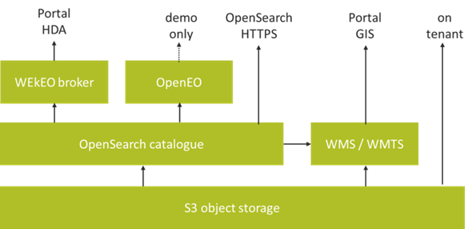

# Accessing HR-VPP data through web services, interfaces (API) and metadata

To meet the needs of different users and use cases, the raster datasets produced in HR-VPP are made available in several ways:

* web portal(s) for user-friendly and interactive discovery, viewing, exploration, and smaller-volume data access:
    * [SDI](./SDI.md) for INSPIRE-compliant metadata and dataset discovery
    * [WEkEO portal](./WEkEO.md) for the initial release and harmonized access across the WEkEO federated cloud (e.g. weather and climate data)
    * [Land portal](./Land_portal.md) for the latest, harmonized access to all Land Service datasets
* web services with programmatic access via API:
    * baseline services, managed by the HR-VPP consortium:
        * A [catalogue service](./Catalogue_service.md) with **OpenSearch API** for dataset discovery, product (file) search
        * A [download service](./Download_service.md) with SSL encryption (**HTTPS**) for file downloads, with authentication and support for range requests
        * A [map viewing service](./Map_viewing_service.md) with **OGC WMS/WMTS API** for map viewing in web portals and GIS
    * managed by the WEkEO team, with support from HR-VPP:
        * [HDA API](./WEkEO.md) for harmonized search and download of HR-VPP and other datasets on the WEkEO federated cloud
    * managed by EEA and its contractors
        * CLMS download API [description](https://land.copernicus.eu/en/how-to-guides/how-to-download-spatial-data/how-to-download-m2m) and [GitHub repository](https://eea.github.io/clms-api-docs/download.html)
    * managed by the cloud provider (CloudFerro), with support from HR-VPP:
        * direct access to the object storage via [S3 API](../01_Cloud_deployment/infrastructure/storage.md), available to tenants on the same cloud (e.g. virtual machines) to facilitate large scale processing and analysis.

The API for data cube processing, based on [OpenEO](https://openeo.org/), was only used for demonstration purposes in the first phase of HR-VPP and is now available from the [Copernicus Dataspace Ecosystem](https://dataspace.copernicus.eu/).

To further support the uptake and illustrate these access methods, HR-VPP provides:
* on the Land portal:
    * a set of [public documentation](https://land.copernicus.eu/en/technical-library/) such as product user manuals and **data access manual**
    * video tutorials on the use of the WEkEO portal for [discovery and viewing](https://land.copernicus.eu/en/products/vegetation/how-to-view-and-explore-high-resolution-vegetation-phenology-and-productivity-data-on-wekeo) and [download](https://land.copernicus.eu/en/products/vegetation/how-to-downlaod-high-resolution-vegetation-phenology-and-productivity-data-on-wekeo)
* GitHub repository with [Jupyter Notebooks](https://github.com/eea/clms-hrvpp-tools-python/tree/main/) for demonstrating the use of the API, written in Python
* GitHub repository with [colour maps and legends](https://github.com/eea/clms-hrvpp-colourmaps), that can be useful for the visualization in GIS or web portals

## API interplay

While this is largely transparent to the user (client), the different web services are connected in the back-end. In other words, the API can be seen as if they are stacked on top of each other.

For example, when a job request is initiated in the WEkEO portal or through the Harmonized Data Access (HDA) machine interface, it is handled by WEkEO’s broker service, that translates the request into a request to the HR-VPP catalogue through its OpenSearch interface. The catalogue service processes the request and informs the broker - through the OpenSearch response - where it can locate the files in the download service (HTTPS) or on the object storage (S3 API). Then, the broker feeds this back to the portal front-end or to the HDA client. In other words, the steps are:
> client > broker (via HDA API) > HR-VPP catalogue (via OpenSearch API) > and back again.

But, as the OpenSearch interface is itself available publicly and can thus be used more directly (without going through HDA first).

The following diagram depicts this interplay between the different interfaces:

## Product type abbreviations

|Abbreviation|Full name|
|------------|---------|
|AMPL|Amplitude|
|EOSD|End-of-Season Date|
|EOSV|End-of-Season Value|
|FAPAR|Fraction of Absorbed Photosynthetically Active Radiation|
|LAI|Leaf Area Index|
|LENGTH|Season Length|
|LSLOPE|Slope of the green-up period|
|MAXD|Season Maximum Date|
|MAXV|Season Maximum Value|
|MINV|Season Minimum Value|
|NDVI|Normalized Difference Vegetation Index|
|PPI|Plant Phenology Index|
|RSLOPE|Slope of green-down period|
|SOSD|Start-of-Season Date|
|SOSV|Start-of-Season Value|
|SPROD|Seasonal Productivity|
|TPROD|Total Productivity|
|QFLAG|Quality Flag related to Seasonal Trajectories and VPP parameters|
|QFLAG2|Quality Flag related to Vegetation Indices|
